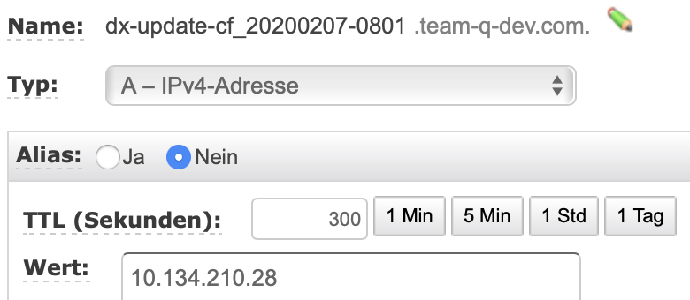

# dx-update-cluster Job

## Description

This pipeline takes a configured 8.5 CF215 base AMI and performs an update to the configured CF version.  In this case, the base AMI contains a full CF215 horizontal cluster.  Both Portal nodes, DB2, the deployment manager and IBM HTTP Server all live on the same box.  This EC2 instance will be configured with a Route53 record. This record can be used to easily access the built environment.  After creation of the EC2 Instance, cluster will be updated to the latest daily CF level. Upon success, a new base AMI with the new CF will be created. EC2 instance, AMI and Route53 entry remain persistent until housekeeping will remove them due to expiration.

## Pipeline flow

The following image describes the basic pipeline flow.

The Job will be triggered by a successful DX-Core build. It will access the DX-Core builds NAME, to determine which build should be used.
This BUILD_LABEL is being used to tag the created resources such as EC2 instance and AMI, so that tasks which will pick those up are aware of the build version.

The running execution of the pipeline will be labeled in the following pattern: `dx-update-cluster_YYYYMMDD-hhmm`.

The pipeline will create an EC2 instance based on the configured CF16 base AMI.
This instance name will be the name of the current pipeline execution, so `dx-update-cluster_YYYYMMDD-hhmm`.
Besides that, the instance will receive a configured time-to-live in hours, that will also be added as a tag.
The DX-Core build label will added as a tag as well.

After creation of the EC2 instance, a Route53 record for the instance with the address `dx-update-cluster_YYYYMMDD-hhmm.team-q-dev.com` will be created.

After all setup steps, the CF update of the DX-Core instance will be performed and test-zips will be copied.

If this step is successful, the pipeline creates an AMI out of the EC2 instance, which will receive the same tags as the EC2 instance.

After a successful run, all temporary data is being removed.

## Generated resources / artifacts

### EC2 instance

An EC2 instance will be created with the following tags (values are an example)

### Route53 record

The following Route53 entry will be created (values are an example)

### AMI

An AMI will be created with the following tags (values are an example)

## Housekeeping / Time-to-live (TTL)

All resources are created with a TTL. The TTL can be configured in the pipeline, default value is 24 hours.
The pipeline will add an `expired` tag to the resources, which contains a timestamp based on SystemMillis().

Housekeeping (seperate job) will check those tags and remove expired resources.

## Connectivity / Dependencies to other Jobs

This pipeline will run after a DX-Core build and pick-up the NAME of the Build which needs to have the following syntax:

`BUILD_CONTEXT_YYYYMMDD-hhmmss_BRACH_NAME`

All other dependent tasks will need to pickup the NAME of this job to determine names of AMI etc.

### Starting the cluster
/opt/IBM/WebSphere/AppServer/profiles/dmgr01/bin/startManager.sh  
/opt/IBM/WebSphere/wp_profile/bin/startNode.sh  
/opt/IBM/WebSphere/wp_profileSecondNode/bin/startNode.sh  
/opt/IBM/WebSphere/wp_profile/bin/startServer.sh WebSphere_Portal   
/opt/IBM/WebSphere/wp_profileSecondNode/bin/startServer.sh WebSphere_Portal_SecondNode  
/opt/IBM/HTTPServer/bin/adminctl start  
### Accessing the cluster

Main URL
http://<ip_address>/wps/portal

Primary Node
http://<ip_address>:10039/wps/portal

Secondary Node
http://<ip_address>:10059/wps/portal

Deployment Manager
http://<ip_address>:9060/admin

User:
wpsadmin

Primary Node Config Wizard
https://<ip_address>:10200/hcl/wizard/

Secondary Node Config Wizard
https://<ip_address>:10207/hcl/wizard/

### Stopping the cluster
/opt/IBM/WebSphere/wp_profile/bin/stopServer.sh WebSphere_Portal -username wpsadmin -password wpsadmin  
/opt/IBM/WebSphere/wp_profileSecondNode/bin/stopServer.sh WebSphere_Portal_SecondNode -username wpsadmin -password wpsadmin  
/opt/IBM/WebSphere/wp_profile/bin/stopNode.sh -username wpsadmin -password wpsadmin  
/opt/IBM/WebSphere/wp_profileSecondNode/bin/stopNode.sh -username wpsadmin -password wpsadmin  
/opt/IBM/WebSphere/AppServer/profiles/dmgr01/bin/stopManager.sh -username wpsadmin -password wpsadmin  
/opt/IBM/HTTPServer/bin/adminctl stop

