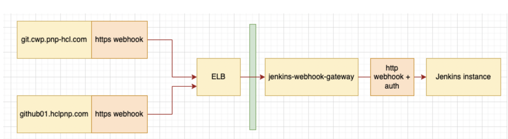

# authentication-proxy / jenkins-webhook-gateway

This pipeline creates a small authentication proxy for the use between GitHub and Jenkins. It's purpose is to add authentication credentials to the webhook requests coming from GitHub.

Since GitHub is not able to add authentication to its webhooks, this proxy approach is required to ensure the webhook calls are successful.

## Directory structure

```text
git-jenkins-integration/
  authentication-proxy/
    docs/                             # Raw drawio data and images
    helpers/                          # Contains all helper files like shell-scripts and the nginx config
    Jenkinsfile                       # Performs the deployment by creating an EC2 instance and a Route53 entry
    parameters.yaml                   # Contains all possible parameters for this pipeline
    README.md                         # This document
```

## Pipeline output

The Pipeline creates an EC2 instance that is configured to act as an authentication proxy. For that purpose a NGINX server is configured.

The NGINX server will check for the user agent and the requests from load balancer to verify if the incoming request is valid. The pipeline will auto fill those configuration values with the default values that are fitting for our `git.cwp.pnp-hcl.com` and `github01.hclpnp.com` instance.

The NGINX proxy will be listening on port `8080` for incoming webhook requests from load balancer.



## Pipeline flow

### Terraform

The pipeline will perform the creation of an EC2 instance of type `t2.micro` which consists of 1 CPU cores and 1GB of memory. This is completely sufficient to run the proxy, since nothing but webhooks will be proxied through.

For that instance there will be a Route53 entry created, that will point the DNS entry `YOUR-INSTANCE_NAME.team-q-dev.com` to the instances private IP.

After that creation has completed, remote scripts are copied via `scp` and executed via `ssh`.

### Scripting

The scripting for this pipeline consists of multiple shell-scripts.

- `00-setup-all.sh` Executes all subsequent setup scripts in the correct order
- `01-setup-nginx.sh` Installs a plain NGINX setup without special configuration
- `02-configure-nginx.sh` Re-configures NGINX with our desired proxy configuration.

The individual steps of these scripts can be seen in their respective code, as it is well commented.

## Configuration of Jenkins Job

### Target Agent

Since this pipeline creates infrastructure, it will run on the `build_infra` agents.

### Parameters

See the `parameters.yaml` for all available parameters.

### Used credentials

This pipeline requires a Jenkins API key to configure the NGINX server. The ID of the credentials used is defined by the parameter `JENKINS_API_CREDENTIAL_ID`.
### Pipeline definition configuration

Configure the Job to use a `Pipeline script from SCM` with the target SCM being `Git`. Use the repository URL `git@git.cwp.pnp-hcl.com:Team-Q/Portal-Test-Automation.git` and a fitting git credential, e.g. `git-ssh-access-key`.

As Branch, specify what you need, default would be `develop`.

For the `Script Path` use `git-jenkins-integration/authentication-proxy/Jenkinsfile`
