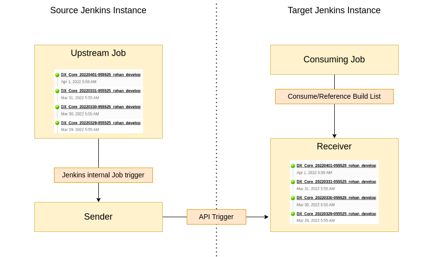
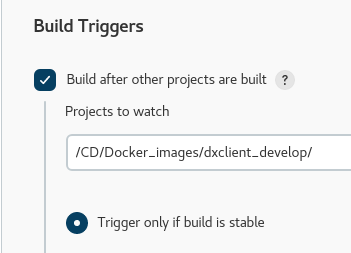
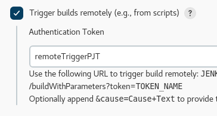

# Pipeline Name to be inserted here

This set of pipelines can be used to mimic Jobs from one Jenkins instance on another.

This is useful if you want to work on Jobs that require the `displayName` of an upstream Job.

## Directory structure

```text
jenkins-job-gateway/
  docs/                           # Contains all documentation related assets
  sender/                         # Contains sender pipeline
  receiver/                       # Contains the receiver pipeline
  README.md                       # This document
```

## Pipeline output

As an example, the DX-Core Image build will require a list of available `SUCCEEDED` DX-Core builds. This information is stored in the the DX-Core build list in Jenkins.

If you want to run your Job on an Jenkins instance that is not performing DX-Core builds on a regular basis, you will need a Job that has the exact same builds in its build list.

To achieve this, there are `two` pipelines in this directory.  
The `sender` (Configured on the `source` Jenkins instance) will get triggered by your `upstream` Job that is on the `source` Jenkins instance. (e.g. Portal Jenkins Test)  
The `receiver` (Configured on the `target` Jenkins instance) will get a remote trigger from the `sender`, every time the sender is being triggered by the `upstream` Job. (e.g. Portal Jenkins Develop)

## Pipeline flow



## Configuration of Jenkins Job

### Target Agent

Both the `receiver` and the `sender` will run on agents labeled with `build_infra`.

### Parameters

#### Sender

| Type | Parameter name | Sample content | Mandatory | Description |
| -- | -- | -- | -- | -- |
| String | RECEIVER_JOB_LINK | `https://portal-jenkins-develop.cwp.pnp-hcl.com/job/Fantabulous-Startroopers/job/philipp-undercover/job/job-gateway/job/receiver/` | Yes | Link to the remote Job that should be triggered. |
| String | RECEIVER_JOB_TOKEN | `remoteTriggerPJT` | Yes | Access Token for the remote Job that should be triggered. |
| String | RECEIVER_API_KEY | `pjd-jenkins-api-key` | No | API Token for target Jenkins instance. |
| Run Parameter | UPSTREAM_JOB | `/build/dx-core` | Yes | Reference build that will be used by the `sender` to get the build names from. |

#### Receiver

| Type | Parameter name | Sample content | Mandatory | Description |
| -- | -- | -- | -- | -- |
| String | RECEIVED_VALUE | `banana` | Yes | Value that the receiver job should use for its DisplayName. |

### Used credentials

Only the sender uses one credential, that is configured by `RECEIVER_API_KEY` and defaults to `pjd-jenkins-api-key`.

### Pipeline definition configuration

Configure the Job to use a `Pipeline script from SCM` with the target SCM being `Git`. Use the repository URL `git@git.cwp.pnp-hcl.com:Team-Q/Portal-Docker-Images.git` and a fitting git credential, e.g. `git-ssh-access-key`.

As Branch, specify what you need, default would be `develop`.

For the `Script Path` use for the `sender` - `jenkins-job-gateway/sender/Jenkinsfile` and for the `receiver` - `jenkins-job-gateway/receiver/Jenkinsfile`

### Trigger configuration

#### Sender and upstream Job

For the `sender`, configure the Job to be triggered by `SUCCEEDED` upstream jobs.



#### Receiver API trigger

For the `receiver`, configure the Job to be triggered by remote, and assign a Token value. That value must be used when configuring the `sender` with the parameter `RECEIVER_JOB_TOKEN`


