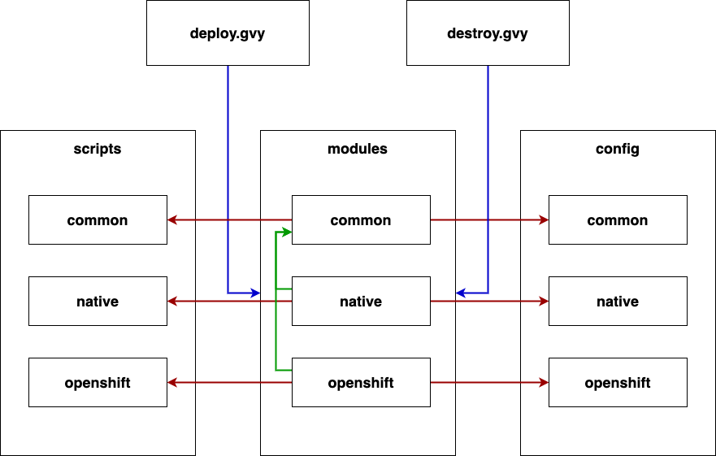

# Kubernetes deployment lifecycle management

## Description

This automation is used to manage the lifecycle of different flavours of kubernetes.
It allows to `create` and `destroy` environments of the following kube flavours:
- `native` - native kubernetes installed on an EC2 instance
- `openshift` - openshift deployment

----
## Configuration parameters

The pipeline supports various configuration parameters that are either common for all flavours or flavour specific.

Please see the following documentations that show the available configuration parameters.

| Configuration file | Description |
|--|--|
| [common](./config/common.md) | Common configuration parameters that are shared between all kube flavours. |
| [native](./config/native.md) | Native kubernetes specific configuration parameters. |
| [openshift](./config/openshift.md) | Openshift specific configuration parameters. |

----
## Implementation parts

### Modules

Found in the `modules` directory. These files define the functions used to perform the actions for each specific flavour of kubernetes.
Please see [modules readme](./modules/README.md) for additional information.

### Scripts

This directory contains all miscellaneous scripts like `shell`, `yaml` etc that are used to support the deployment process.
Please see [scripts readme](./scripts/README.md) for additional information.

### Config

Found in the `config` directory. These files define config parameters for the different kubernetes flavours. It also defines fitting defaults which can be overwritten via parameters that are optionally defined via the Jenkins Pipeline Configuration.
Please see [config readme](./config/README.md) for additional information.

### Overview

This automation consists of main groovy pipelines. One is used to manage the deployment (`deploy.gvy`) and the other one is handling the destruction of existing environments (`destroy.gvy`).

Both pipelines have in common, that they leverage the `common` configuration to determine what kubernetes flavour to use.
From there on, they load the corresponding flavour module and execute the actions defined in the pipeline.