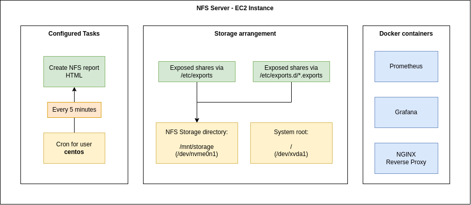
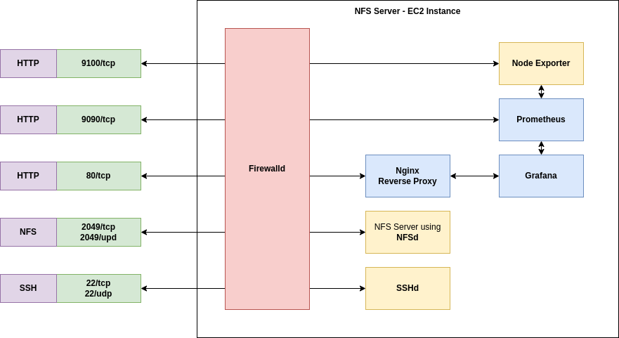

# nfs-server

This pipeline creates a stand-alone NFS Server that runs inside AWS. The server can be used for NFS storage and persistent volumes in Kubernetes Clusters that have access to the AWS infrastructure.

The name of the instance is controlled via the Pipeline Parameters.

## Directory structure

```text
nfs-server/
  helpers/                          # Contains all helper files like shell-scripts and the nginx config
  Jenkinsfile                       # Performs the deployment by creating an EC2 instance and a Route53 entry
  parameters.yaml                   # Contains all possible parameters for this pipeline
  README.md                         # This document
```

## Pipeline output

The Pipeline creates an EC2 instance that is configured to expose NFS storage. If the instance in use has dedicated NVMe storage, the pipeline will automatically configure that storage to be used for the NFS exports.



The created instance will provide a report of all NFS exports and a Grafana Dashboard that can be used to monitor the servers performance and health.

The report is created every 5 minutes via a cron-job that runs with the `centos` user.

The dashboard and report can be accessed via `http://YOUR-INSTANCE-NAME.team-q-dev.com/` with the credentials `admin:p0rtal4u`.

All networking is secured by using `firewalld`, only allowing for a certain set of services to run. The NGINX reverse proxy will route through grafana traffic and host the NFS status report.

The Grafana dashboards and datasource are automatically provisioned.

The Node-Exporter is installed **natively** on the EC2 instance, since it needs access to the NFS statistics.



## Pipeline flow

### Terraform

The pipeline will perform the creation of an EC2 instance of type `i3.xlarge` which consists of 4 CPU cores and 30.5GB of memory. It also has a dedicated NVMe SSD that allows for high I/O performance, which is a requirement for our NFS Servers.

For that instance there will be a Route53 entry created, that will point the DNS entry `YOUR-INSTANCE_NAME.team-q-dev.com` to the instances private IP.

After that creation has completed, remote scripts are copied via `scp` and executed via `ssh`.

### Scripting

The scripting for this pipeline consists of multiple shell-scripts.

- `00-setup-all.sh` Executes all subsequent setup scripts in the correct order
- `01-setup-nfs-server.sh` Configures the NVMe storage, NFS Server and creates a default export for testing.
- `02-setup-docker.sh` Installs docker as a container runtime to host grafana, prometheus and nginx.
- `03-setup-setup-monitoring.sh` Configures Prometheus, Grafana, the Node-Exporter and NGINX. Will also create a cron-job that runs `generate-report.sh` every 5 minutes.

The individual steps of these scripts can be seen in their respective code, as it is well commented.

Both containers are set to restart. This ensures they will start if the machine gets rebooted.

## Configuration of Jenkins Job

### Target Agent

Since this pipeline creates infrastructure, it will run on the `build_infra` agents.

### Parameters

See the `parameters.yaml` for all available parameters.

### Used credentials

Create a list of credentials that is used by this pipeline, also describe which stage of the pipeline uses it:

| Credential ID | Used ENV vars | Description | Affected Pipeline Stage |
| -- | -- | -- | -- |
| test-automation-deployments | `DEPLOY_KEY` | Used to access the remote instance via ssh. | `Setup NFS Server` |

### Pipeline definition configuration

Configure the Job to use a `Pipeline script from SCM` with the target SCM being `Git`. Use the repository URL `git@git.cwp.pnp-hcl.com:Team-Q/Portal-Test-Automation.git` and a fitting git credential, e.g. `git-ssh-access-key`.

As Branch, specify what you need, default would be `develop`.

For the `Script Path` use `nfs-server/Jenkinsfile`
